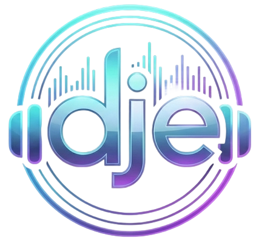

<p align="center">
  
</p>

# Dje

Self-hosted Discord music bot for small servers: you run it locally, you control everything.

## What is Dje?

Dje is a self-hosted Discord music bot written in Python.

- No central server, no shared infrastructure.
- No public “one bot for everyone”.
- You run Dje on your own machine (PC, server, or VPS).
- You bring your own Discord bot token and (optionally) your own Spotify Client Credentials.
- Designed for personal and private Discord servers where you want full control and no artificial limits.

Dje is not a hosted service, and it is not a public bot you invite from a website. There is no SaaS component.

## Key Features

- YouTube playback: play by URL or search; supports playlists (limited).
- Spotify links: resolves Spotify metadata and plays via YouTube.
- Shortcut playlists: per-guild named shortcuts for quick playback.
- Localization: English and Turkish.
- Per-guild persistent settings (locale and shortcuts).
- Idle auto-disconnect with localized warning clip.
- Interactive UI: embeds and shortcut buttons.
- Fully local and self-hosted: no queue caps imposed by Dje (provider limits still apply).

## Localization

Dje currently supports:

- English (`en`)
- Turkish (`tr`)

Locale is selected per guild via `/language` (alias: `/lang`) and persisted in `data/guild_settings.json`.

Adding more languages is straightforward: extend `src/dje/i18n.py` and wire the new locale into the command choices.

## Project Philosophy

- Privacy-first: your bot runs on your machine, for your server.
- No central infrastructure: no shared backend, no shared token, no tracking service.
- Ownership: you own the Discord application, the credentials, and the runtime.
- Simple and hackable: readable Python, minimal moving parts, transparent behavior.

## Directory Structure

```
.
├── assets/                  # Repository assets
├── src/
│   └── dje/                 # Main Python package (bot + playback)
│       ├── __main__.py      # Entry point for `python -m dje`
│       ├── bot.py           # Slash commands and Discord client setup
│       ├── player.py        # Queue, playback loop, downloads/cache
│       ├── youtube.py       # YouTube resolving via yt-dlp
│       ├── spotify.py       # Spotify link parsing and resolution
│       ├── voice.py         # Voice channel connect/disconnect helpers
│       ├── settings.py      # Per-guild persisted settings
│       ├── i18n.py          # Localization strings
│       └── ui_shortcuts.py  # Shortcut buttons UI
├── bin/                     # Local binaries (ffmpeg/opus; auto-installed by setup scripts)
├── .env.example             # Environment variable template
```

## Installation

### Prerequisites

- Git
- Python 3.9+ (Linux users: install `python3-venv` so `python -m venv` works)
- Discord bot token (you create the bot in the Discord Developer Portal)
- Spotify credentials (optional, required only for Spotify links):
  - `SPOTIFY_CLIENT_ID`
  - `SPOTIFY_CLIENT_SECRET`
- Linux: `sudo` access recommended so setup can install system packages

> No manual binary downloads required — `setup.bat` / `setup.sh` automatically install or download FFmpeg and the Opus library.
> If a package manager is available, the scripts use it; otherwise they download what’s needed (and keep any local binaries under `bin/`).

### Discord bot creation (high-level)

- Create a Discord application and add a bot user.
- Enable the required intents/permissions for voice and messaging as needed.
- Invite the bot to your server with the `applications.commands` scope so slash commands work.

> Discord setup guide: [SETUP_DISCORD.md](SETUP_DISCORD.md)

### Spotify client credentials

> Spotify setup guide: [SETUP_SPOTIFY.md](SETUP_SPOTIFY.md)

## Quick Start

### Windows (PowerShell or CMD)

```bat
git clone https://github.com/gkhntpbs/Dje.git
cd Dje
copy .env.example .env
notepad .env
.\setup.bat
.\run.bat
```

Note: In `.env`, set at least `DISCORD_TOKEN` (optional: `DISCORD_GUILD_ID`, Spotify credentials).

### macOS/Linux

```bash
git clone https://github.com/gkhntpbs/Dje.git
cd Dje
cp .env.example .env
chmod +x setup.sh run.sh
./setup.sh
./run.sh
```

Note: In `.env`, set at least `DISCORD_TOKEN` (optional: `DISCORD_GUILD_ID`, Spotify credentials).

### What setup does

- Creates `.venv/` and installs Python dependencies
- Ensures FFmpeg is available (uses a package manager when possible; otherwise downloads)
- Ensures the Opus library is available (package manager on macOS/Linux; downloads `libopus-0.dll` into `bin/` on Windows)
- Creates required local folders (`bin/` and `downloads/`)

### Manual venv workflow (optional)

If you prefer not to use the scripts, make sure `ffmpeg` and the Opus library are available on your system:

```bash
python3 -m venv .venv
. .venv/bin/activate
python -m pip install -U pip
pip install -e .
python -m dje
```

## Usage

1. Invite your bot to your Discord server.
2. Start Dje locally (see Quick Start).
3. Join a voice channel.
4. Use `/play` with a YouTube URL, playlist URL, Spotify URL, or a search query.

Notes:

- YouTube playlist requests are limited (currently 50 tracks per request).
- Spotify playlists/albums are limited (currently 50 tracks per request) and are resolved to YouTube playback.
- Individual tracks have a duration limit (currently 20 minutes).
- `/play` appends to the end of the queue; `/playnext` inserts as the next items.

## Commands

### Playback

- `/play <query-or-url>` (alias: `/p`): Play a track by search/URL; supports Spotify links.
- `/playnext <query-or-url>`: Insert right after the current track.
- `/pause` (alias: `/pa`): Pause playback.
- `/resume` (alias: `/r`): Resume playback.
- `/skip` (alias: `/sk`): Skip the current track.
- `/next` (alias: `/n`): Alias for skip.
- `/prev` (alias: `/pr`): Play the previous track from history.
- `/stop` (alias: `/st`): Stop playback and clear the queue.

### Queue

- `/queue` (alias: `/q`): Show previous/now playing/up next.

### Voice

- `/join` (alias: `/j`): Join your voice channel.
- `/leave` (alias: `/l`): Leave the voice channel.

### Shortcuts

- `/shortcuts`: List shortcuts with interactive buttons.
- `/sc`: Alias for `/shortcuts`.
- `/shortcuts add <name> <url>` (alias: `/shortcuts a`): Save a shortcut (YouTube/Spotify URL).
- `/shortcuts remove <name>` (alias: `/shortcuts rm`): Remove a shortcut.
- `/shortcuts play <name-or-number>` (alias: `/shortcuts p`): Play a shortcut by name, or by number from the last `/shortcuts` list.

### Settings

- `/language <tr|en>` (alias: `/lang`): Set the guild locale.
- `/settings autodisconnect <on|off>`: Enable or disable idle auto-disconnect.
- `/settings autodisconnect_minutes <minutes>`: Set idle timeout (20-360).
- `/settings show`: Show current guild settings.

### Info

- `/info` (alias: `/i`): Show bot info.

## Shortcuts System

Shortcuts are per-guild, named links that you can save and replay quickly.

- Add a shortcut: `/shortcuts add <name> <url>`
- List shortcuts (with buttons): `/shortcuts` (or `/sc`)
- Play a shortcut by name: `/shortcuts play <name>`
- Play by number (after listing): `/shortcuts play 1`

Shortcuts are persisted in `data/guild_settings.json` (the `data/` directory is typically gitignored).

## Idle Auto-Disconnect

When the bot is idle (not playing and queue empty), it starts a timer. Fifteen minutes
before disconnect it plays a localized warning clip in the voice channel.

Defaults:

- Enabled
- Timeout: 60 minutes
- Warning: 15 minutes before disconnect

Warning audio files live in `assets/warn_tr_.wav` (or `assets/warn_tr.wav`) and `assets/warn_en.mp3`.
If they are missing, the bot will send a localized text warning instead.

## License

Dje is licensed under the MIT License.

You can use, modify, and redistribute it (including commercially), as long as the license notice is preserved.

## Support

If Dje is useful to you and you want to support ongoing maintenance, you can optionally contribute here:

[☕ Buy Me a Coffee](https://www.buymeacoffee.com/gkhntpbs)

No paid features, no “pro” tier, and no obligation.

## Contributing

See `CONTRIBUTING.md`.

## Roadmap

See `ROADMAP.md`.

_Note: This project was written with the help of AI tools._
